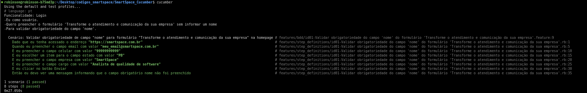

# Estruturas
## Arquivos

- **feature**
    - **bdd** -> Pasta contendo sintaxe Gherkin (plano de ação)
        - `id01-Validar obrigatoriedade do campo 'nome' do formulário 'Transforme o atendimento e comunicação da sua empresa'.feature` -> Arquivo de exemplo contendo o plano de ação para execução de um cenário e case
    - **pages** -> Pasta contendo páginas com elementos mapeados
        - `home_page.rb` -> Arquivo de mapeamento de elementos da página inicial
    - **step_definitions** -> Pasta contendo as etapas de teste
        - `id01-Validar obrigatoriedade do campo 'nome' do formulário 'Transforme o atendimento e comunicação da sua empresa'.rb` -> Arquivo de exemplo contendo a sintaxe em Capybara/[R]u[b]y para manipulação de elementos e implementação das etapas de teste
    - **support** -> Pasta contendo arquivos para configuração de ambiente e helpers
        - `home_page.rb` -> [NÃO UTILIZADO] Arquivo de mapeamento de elementos da página inicial
        - **data** -> Pasta contendo páginas com elementos mapeados
            - `test.yml` -> Arquivo de configuração simplificado de ambiente de testes
        - `env.rb` -> Arquivo de configuração detalhado de ambiente de testes
        - `page_helper.rb` -> Arquivo de auxílio para criação de objetos de forma autônoma
- `cucumber.yml` -> Arquivo de configuração principal de ambiente de testes
- `readme.md` -> Arquivo com sintaxe [m]ark[d]own

# Executar Cucumber
## Clonar o projeto
`https://github.com/robinsonmourao/SmartSpace_Cucumber.git`
## Abrir o terminal e acessar a pasta raíz do projeto
`cd <path-do-projeto>/SmartSpace_Cucumber`
## Executar o comando cucumber
`cucumber`

# Fotos do projeto em execução

# Status de desenvolvimento

| Tarefa             | Status        |
|--------------------|---------------|
| Desenvolvimento de plano de ação    | CONCLUÍDO |
| Implementação                       | CONCLUÍDO |
| ~~Mapeamento_de_elementos_da_homepage~~ | CANCELADO |